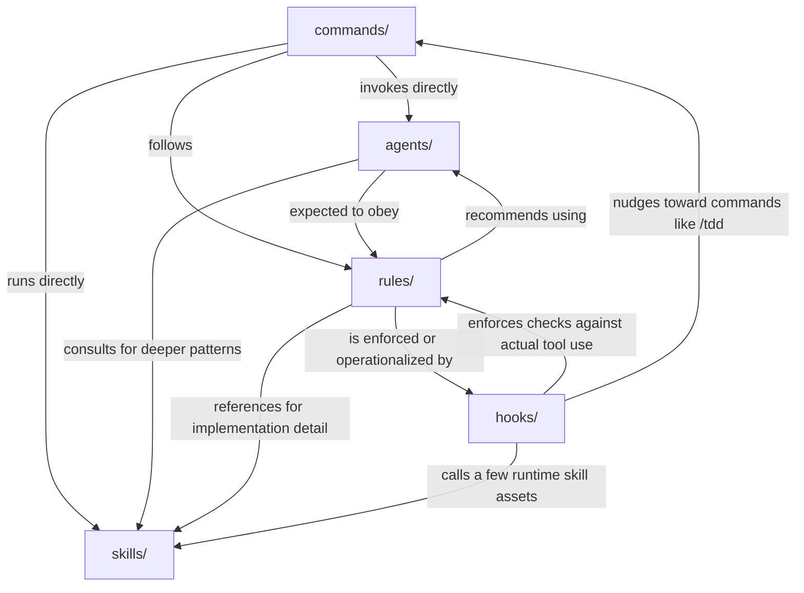
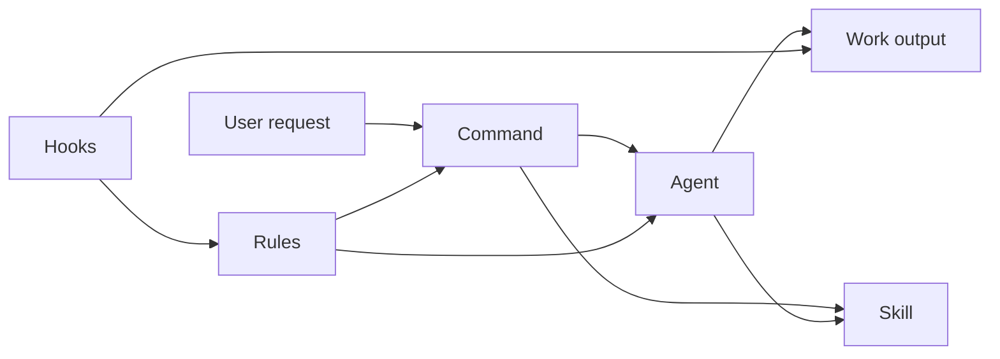

# Component Coordination Reference

This document explains how ECC's five main coordination surfaces fit together:

- `skills/`
- `agents/`
- `commands/`
- `rules/`
- `hooks/`

Use it as a quick reference when you need to understand who triggers whom, which relationships are hard-wired vs guidance-only, and what a real workflow looks like in practice.

## Dependency Figure



## Coordination Table

| Component | Depends on | Strength | How | Example |
|---|---|---:|---|---|
| `commands/` | `agents/` | High | Explicitly invokes named agents | `commands/plan.md`, `commands/tdd.md` |
| `commands/` | `skills/` | High | Some commands directly run skills | `commands/context-budget.md` |
| `commands/` | `rules/` | Medium | Commands are written to follow repo workflow and policy | `commands/tdd.md` |
| `commands/` | `agents/` + `skills/` | Very High | Central routing map exists for both | `docs/COMMAND-AGENT-MAP.md` |
| `agents/` | `skills/` | Medium | Agents reference skills for deeper domain guidance | `agents/security-reviewer.md`, `agents/e2e-runner.md` |
| `agents/` | `rules/` | Medium | Agents are expected to operate inside repo standards | `rules/common/code-review.md` |
| `rules/` | `agents/` | High | Rules explicitly tell you which agents to use | `rules/common/security.md` |
| `rules/` | `skills/` | High | Rules reference skills for implementation detail | `rules/python/testing.md`, `rules/golang/testing.md` |
| `rules/` | `hooks/` | Medium-High | Hooks operationalize many rule-like checks | `hooks/README.md` |
| `hooks/` | `rules/` | High | Runtime checks enforce policy during tool use | `hooks/README.md` |
| `hooks/` | `skills/` | Medium | A few hooks directly execute skill-owned assets | `hooks/hooks.json`, `skills/continuous-learning-v2/hooks/observe.sh` |
| `hooks/` | `commands/` | Low-Medium | Hooks sometimes steer users toward command workflows like `/tdd` | `hooks/README.md` |
| `skills/` | `agents/` | Low | Skills are usually a knowledge source, not a dispatcher | `agents/python-reviewer.md` |
| `skills/` | `rules/` | Low | Skills usually complement rules rather than depend on them | `rules/php/testing.md` |

## Relationship Notes

### 1. Commands are the coordinator layer

Commands are the most explicit dispatcher in the system.

- `/plan` invokes `planner`
- `/tdd` invokes `tdd-guide`
- `/code-review` invokes `code-reviewer`
- `/orchestrate` chains multiple agents
- `/context-budget` runs a skill directly

If you want to know where a workflow starts, look at `commands/` first.

### 2. Agents are the specialist execution layer

Agents encapsulate task-specific reasoning and execution patterns such as planning, TDD, review, security review, or build fixing.

They do not usually own all domain detail themselves. When needed, they point to skills for deeper guidance.

### 3. Skills are the reusable knowledge layer

Skills are long-form, reusable playbooks.

- Rules often reference skills for the "how"
- Commands sometimes run skills directly
- Agents sometimes consult skills for deeper patterns
- Hooks occasionally call assets that live inside a skill directory

### 4. Rules are the policy layer

Rules define standards, escalation triggers, and expected workflow.

They often say things like:

- use `security-reviewer` in security-sensitive situations
- use specific language or framework skills for deeper guidance
- follow testing, review, and security requirements before completion

### 5. Hooks are the runtime enforcement layer

Hooks are where policy becomes operational.

They automatically run around tool usage and session lifecycle to:

- warn
- block
- format
- typecheck
- check quality
- capture observations
- remind the user about workflow steps

## Real Workflow Example

This is a realistic ECC flow for a feature such as "Add user authentication."

### Step 1. Start with a command

The user runs:

```text
/plan "Add user authentication"
```

This starts at the command layer, which routes the request to the `planner` agent.

### Step 2. Planner creates the implementation plan

The `planner` agent:

- restates requirements
- identifies dependencies and risks
- breaks work into phases
- waits for user confirmation before code changes

At this stage:

- `commands/` is driving
- `agents/` is executing
- `rules/` are already shaping expected behavior

### Step 3. Implementation switches to TDD

After approval, the user runs:

```text
/tdd
```

Now the command layer routes to `tdd-guide`.

The TDD workflow also aligns with the `tdd-workflow` skill, which provides deeper RED -> GREEN -> REFACTOR guidance.

At this stage:

- `commands/` dispatches
- `agents/` executes
- `skills/` deepens the method

### Step 4. Hooks fire while editing

As files are edited, hooks run automatically.

Typical hook behavior includes:

- pre-commit quality checks
- doc-file warnings
- config protection
- quality gate
- formatters
- typecheck
- console warnings

At this stage:

- `hooks/` is enforcing
- `rules/` are being operationalized

### Step 5. Security-sensitive work escalates by rule

If the feature touches:

- authentication
- authorization
- user input
- database queries
- secrets

the rules escalate to a security review path.

That usually means invoking `security-reviewer` directly or as part of a later review chain.

At this stage:

- `rules/` is deciding when escalation is required
- `agents/` provides the specialized reviewer

### Step 6. Review happens before completion

The user then runs:

```text
/code-review
```

Or uses an orchestrated flow such as:

```text
/orchestrate feature "Add user authentication"
```

In the orchestrated version, the chain is:

```text
planner -> tdd-guide -> code-reviewer -> security-reviewer
```

At this stage:

- `commands/` coordinates the sequence
- `agents/` perform the specialized passes
- `rules/` define what "ready" means
- `hooks/` may continue warning or checking during edits

### Step 7. Continuous learning hooks may capture reusable patterns

During or after the session, lifecycle hooks may record observations.

This is one of the clearest cross-surface integrations in ECC because hooks directly call assets that live under the continuous-learning skill tree.

At this stage:

- `hooks/` is collecting
- `skills/` provides the runtime asset

## Workflow Chain Summary



## Quick Reading Guide

If you are debugging coordination problems:

- Check `commands/` first when the wrong workflow starts
- Check `agents/` when the workflow starts correctly but behaves incorrectly
- Check `skills/` when the workflow lacks depth or domain guidance
- Check `rules/` when expected standards or escalation are unclear
- Check `hooks/` when behavior appears automatic, blocking, or session-lifecycle-related

## Bottom Line

ECC is not five parallel folders doing unrelated things.

It is a layered coordination system:

- `commands/` start the workflow
- `agents/` execute specialized work
- `skills/` provide deep reusable guidance
- `rules/` define standards and escalation
- `hooks/` enforce and observe the workflow at runtime
