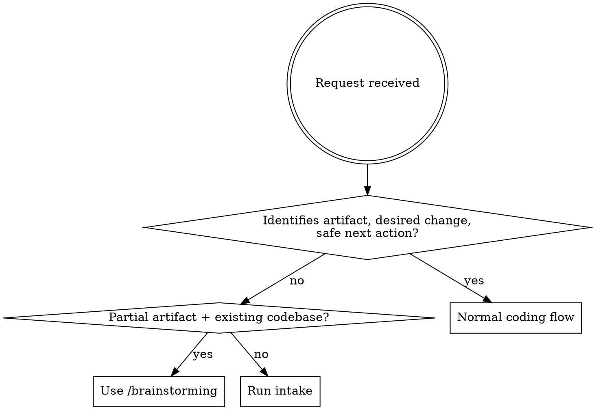

# Intake

## Overview

Intake is a domain-to-code bridge. It stabilizes a user's real-world intent before it becomes coding work, producing a confirmed idea frame and a coding-facing downstream prompt — not a plan, not execution.

## When to Use



**Good intake cases:**
- Scientific, theoretical, or research intent → may become a simulation, notebook, or pipeline
- Workflow or product intent where the computational target is not yet identified
- Requests with a user-stated premise that should be validated before code changes
- Conceptual or analytical intent where the artifact is unknown or unstable

**Do not use for:**
- Fix / debug / refactor / test / implement requests
- Inspect a file, module, repository, or error
- Add a feature with a stable software goal

If explicitly invoked on an ordinary coding request, say briefly that it is already coding-facing and stop. Do not run the full flow.

## Quick Reference — Labels

**REQUEST_ORIGIN** — pick one:

| Label | Meaning |
|---|---|
| `SCIENCE` | Scientific, mathematical, theoretical, or simulation intent |
| `RESEARCH` | Investigation, evidence gathering, comparison, or reproduction intent |
| `ANALYSIS` | Data/log/result interpretation or measurement intent |
| `WORKFLOW` | Manual process, operational flow, or automation intent |
| `PRODUCT` | User-facing, stakeholder, UX, or product outcome intent |
| `CONCEPTUAL` | Idea exploration, taxonomy, decision framing, or explanation intent |
| `MIXED` | Multiple origins are genuinely entangled |

**PREMISE_STATUS** — pick one:

| Label | Meaning |
|---|---|
| `EVIDENCE_BACKED` | Evidence supplied or already established in the request |
| `ACCEPTED_AS_GIVEN` | User requirement or definition; not to verify |
| `UNVERIFIED` | May be true; no evidence supplied |
| `CONTRADICTED` | Conflicts with supplied evidence or established facts |
| `INCOMPLETE` | Lacks enough context to interpret |
| `NONE` | No material premise stated |

If the premise is statable but lacks corroborating evidence, use `UNVERIFIED`. If it cannot be interpreted without more user input, use `INCOMPLETE`.

**CODING_NEED** — pick one:

| Label | Meaning |
|---|---|
| `YES` | Confirmed idea likely needs code/config/notebook/tests/simulation/repo work |
| `NO` | Confirmed idea is non-coding |
| `UNCERTAIN` | Coding may or may not be needed; next workflow must decide |

## Implementation

### Phase 1 — Idea Frame

Ask: *What is the user actually trying to understand, prove, compare, automate, simulate, or decide?*

Do not ask for files, libraries, architecture, or implementation route unless they are necessary to resolve a blocker (see blocking rule below).

Emit this block, then pause:

```text
--- Idea Frame ---
REQUEST_ORIGIN: <label>
Domain goal: <real-world/scientific/product/workflow/conceptual outcome>
Object/process: <thing being studied, transformed, compared, automated, or decided; omit if none>
User-stated premise: <claim, diagnosis, mechanism, or proposed method; omit if none>
PREMISE_STATUS: <label>
Success evidence: <what observation/result would satisfy the domain goal>
Ambiguity: <useful non-blocking unknowns; omit if none>
Blocking: <idea-level unknowns that must be resolved before coding translation; omit if none>
```

**Blocking rule.** A missing detail is blocking only if its answer would change at least one of:
1. Whether coding is needed at all
2. The computational target
3. The required input
4. The expected output
5. The validation method

Implementation details (file paths, library choices, architecture) are never blocking. `CONTRADICTED` premises are always blocking. `UNVERIFIED` premises are non-blocking when they can be carried forward neutrally without being accepted as fact.

- If `Blocking` is absent: ask `Does this capture your idea? Correct anything before I translate it into a coding-facing prompt.`
- If `Blocking` is present: ask only for what resolves those blockers. Do not ask about `Ambiguity` items.

Wait for the user's response.

- If the user explicitly confirms: move to Phase 2.
- Otherwise: synthesize the original request plus all responses so far into one richer idea statement, re-derive the entire Idea Frame from scratch, and repeat the ask.

Phase 2 runs only after explicit confirmation.

### Phase 2 — Coding Translation

Echo the confirmed Idea Frame verbatim, then emit:

```text
--- Confirmed Idea Frame ---
<echo the final confirmed Idea Frame as-is>

--- Coding Translation ---
CODING_NEED: <YES | NO | UNCERTAIN>
Execution posture: <`immediate` — enough context exists for downstream action | `context-first` — repo/data context must be inspected first | `science-first` — conceptual/methodological validity must be clarified first | `none` — CODING_NEED is NO>
Computational target: <known target | project-dependent | unknown | none>
Candidate artifact: <script | notebook | config | simulation setup | test harness | CLI | app feature | analysis pipeline | benchmark | document | undecided | none>
Candidate artifact rationale: <why this artifact type, or why undecided>
Required inputs: <data, parameters, examples, paper result, user workflow, logs, repo context, etc.>
Expected outputs: <plot, table, metric, config, test result, feature behavior, report, reproduction, etc.>
Validation method: <evidence that would show the coding work served the domain goal>

Known non-blocking ambiguities:
- <uncertainty downstream work should preserve; omit if none>

Project context needed before implementation:
- <repo/project fact a downstream workflow should inspect; omit if none>

Open coding questions:
- <implementation-facing question left for planning/inspection; omit if none>

Suggested downstream class: <planning | retrieval/context | coding | research | none>
This is metadata only; do not invoke the suggested class.

Downstream prompt:
"""
<one concise coding-facing prompt; preserve the confirmed goal, artifact type, premise status, required inputs/outputs, validation evidence, and project context needed; omit step-by-step implementation, tool calls, routing commands, and speculative architecture>
"""
```

Hard stop after emitting the Coding Translation. Do not invoke the suggested downstream class; wait for the user or caller to choose the next workflow.

## Common Mistakes

| Mistake | Correction |
|---|---|
| Running intake on an ordinary coding request | Say it is already coding-facing and stop; do not run the full flow. |
| Asking about file paths, libraries, or architecture in Phase 1 | Those are never blocking — only ask what changes the five blocking criteria. |
| Marking `UNVERIFIED` premises as blocking | Carry them forward neutrally; they do not block Phase 2. |
| Treating `CONTRADICTED` premises as non-blocking | Contradicted premises always block Phase 2; surface the conflict explicitly. |
| Moving to Phase 2 without explicit user confirmation | Synthesize all input and re-derive the Idea Frame; do not infer approval. |
| Invoking a downstream workflow after Phase 2 output | Hard stop. Metadata only — do not route. |
| Treating `INCOMPLETE` like `NONE` | `INCOMPLETE` is blocking; ask only what is needed to interpret the premise. |
